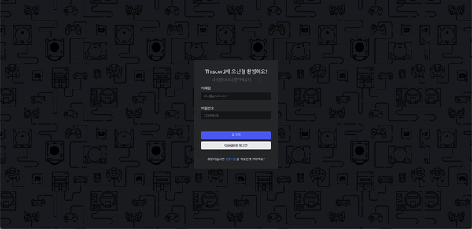
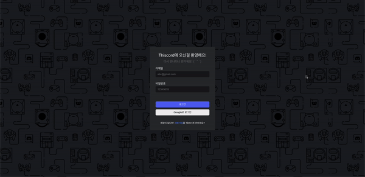
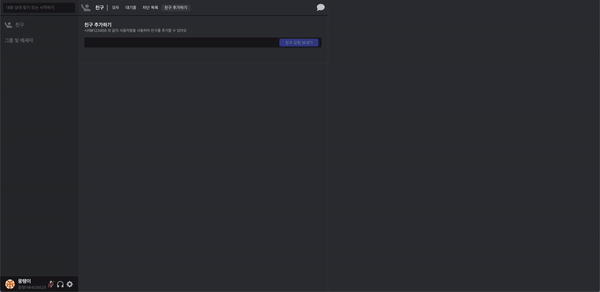
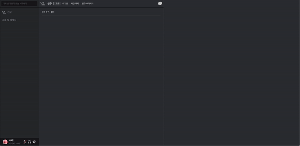
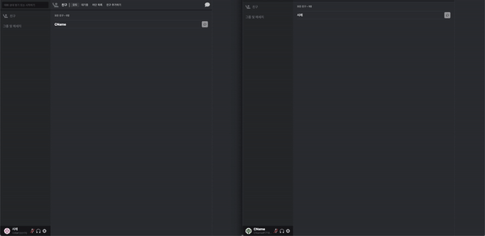
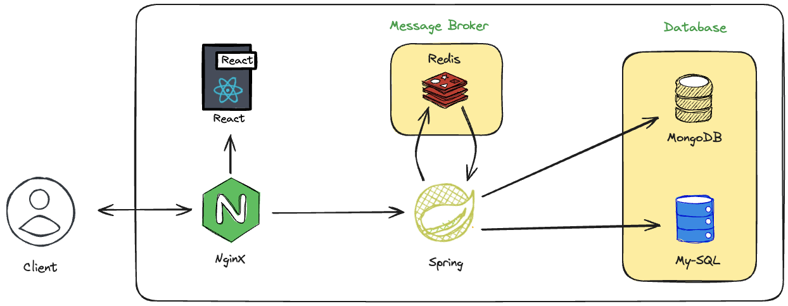

# Discord Clone - Thiscord

## 데모

### 데모 실행

```shell
# 데모를 실행하기 위해서 아래의 명령어를 입력해주세요.
$ sudo ./demo.sh

# 명령어 실행 후, 브라우저를 통해 localhost:80 도메인으로 접속해주세요.
```

데모용 아이디 및 페스워드는 아래와 같아요.  
Id : demo@demo.com  
password : demo  

### 의존성
- Java17
- npm 9.5.0
- Docker version 20.10.22

### 로그인/회원가입

|  |  |
| -------------------------------------------- | ------------------------------------------------- |
| 로그인                                       | 회원가입                                          |

### 친구관리

|  |  |
| ----------------------------------------------------- | -------------------------------------------------------- |
| 친구추가                                              | 친구수락                                                 |


### 1:1 DM

|  |
| ----------------------------------------------------- |
| 채팅방 입장          |

## 프젝트 구조


